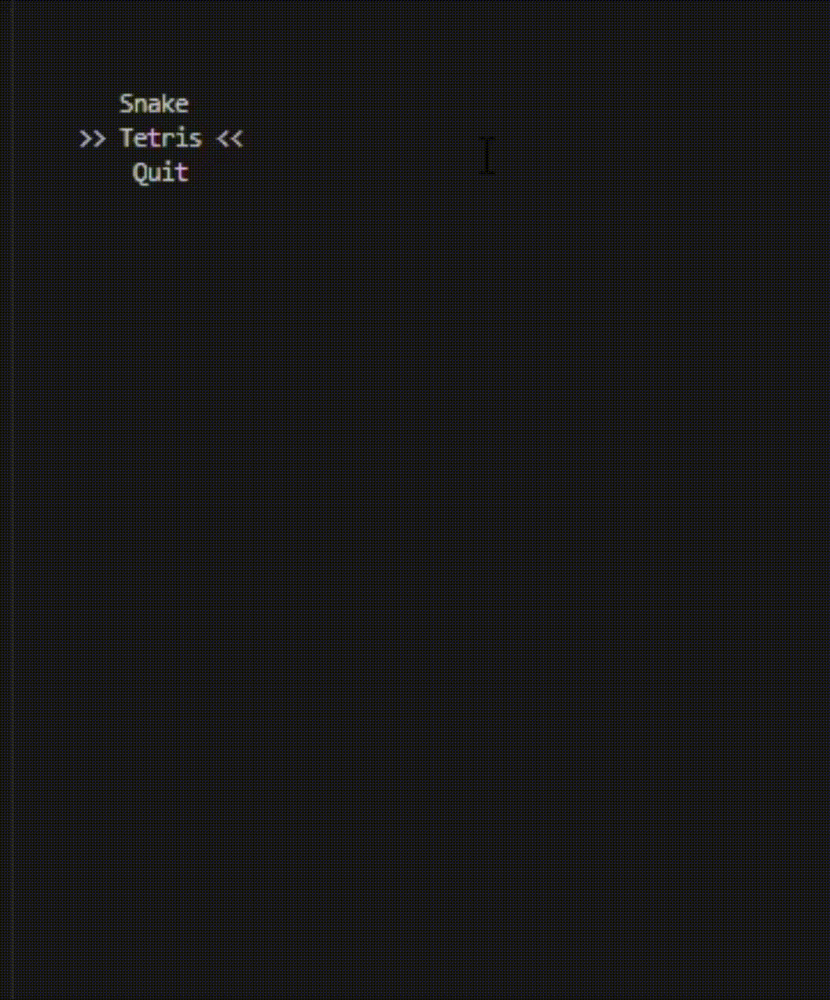

# Snake_game

Ревлизация игры "Змейка"

### Описание проекта

- Программа разработана на языке C++ стандарта C++17.
- Программа состоит из двух частей: библиотеки, реализующей логику игры змейка, и десктопного интерфейса.
- Для формализации логики игры использован конечный автомат.
- Реализация с графическим пользовательским интерфейсом, на базе одной GUI-библиотеки с API для C++17:
     - ImGUI
- Программrа реализована с использованием паттерна MVC.

### Cli Interface



## Сборка проекта

```
$ make
```

## Тесты

Unit-тесты реализованы при помощи gtest/gtest.h, отчет о покрытии при помощи [LCOV](https://github.com/linux-test-project/lcov)

```
$ make test
```

Отчет о покрытии:

```
$ make gcov_report
```

## Документация проекта

```
$ make dvi
```
